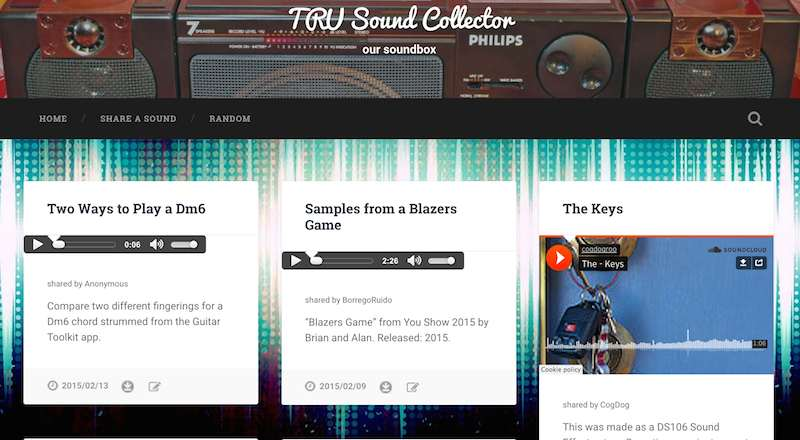
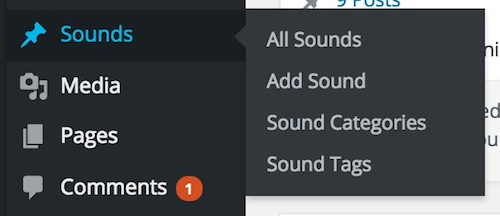
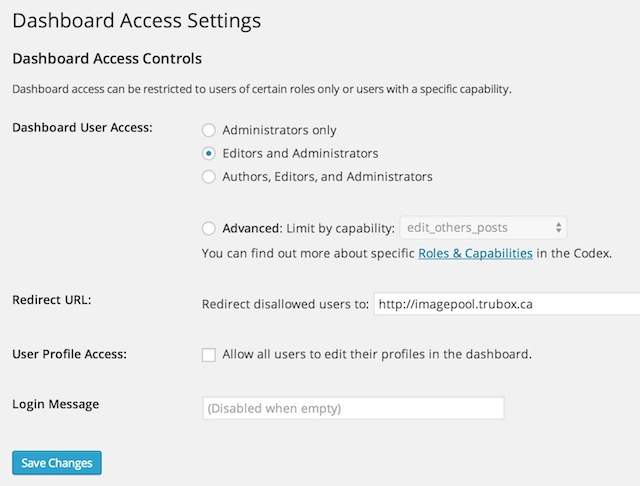
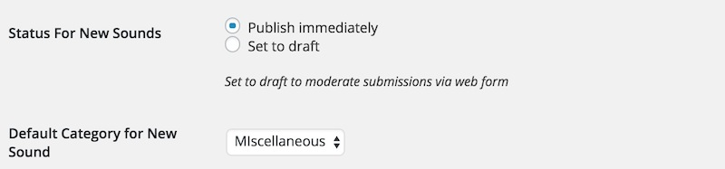
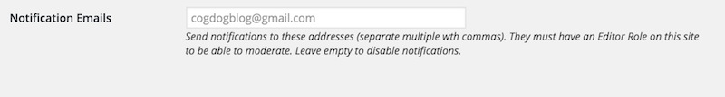
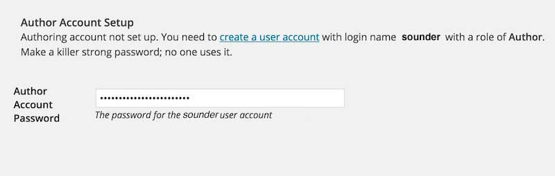
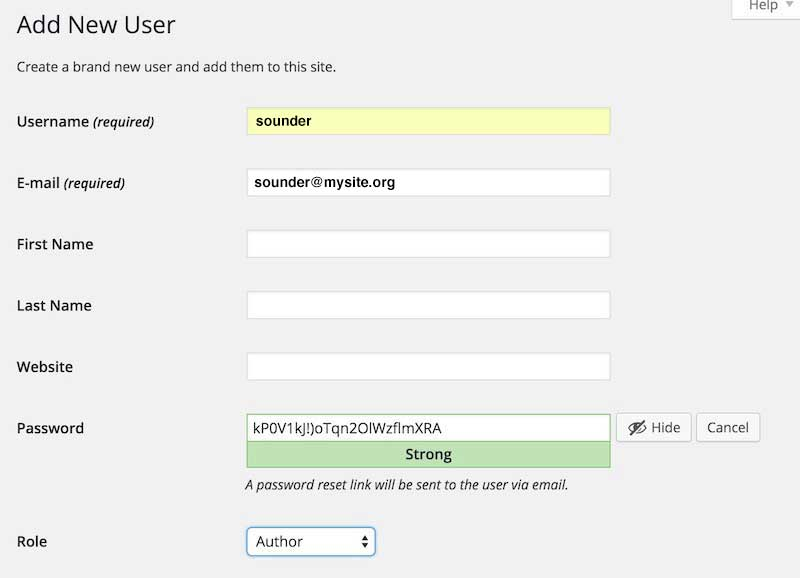
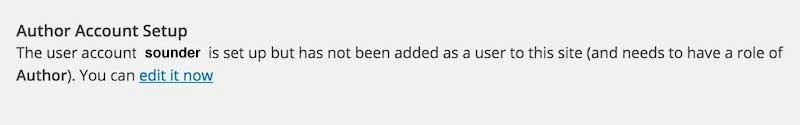
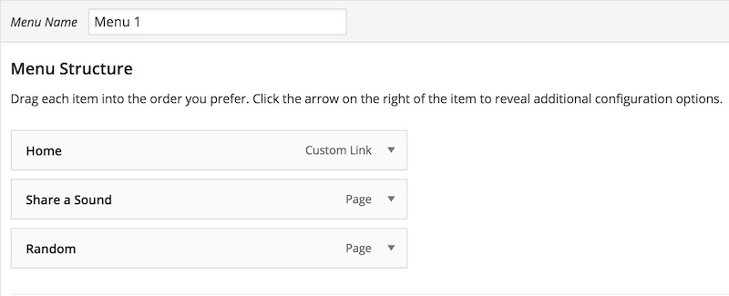
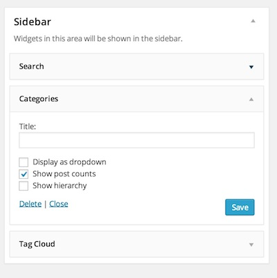

# TRU Sound Collector Wordpress Theme
by Alan Levine http://cogdog.info/ or http://cogdogblog.com/

## What is this?
This Wordpress Theme  powers [TRU Sound Collector](http://splot.ca/spunder/) a site to share a collection of audio files-- sounds or music--  where contributions can be made without any silly logins. This is done by using a generic author account that is silently activated. The user never sees any sign of the innards of Wordpress but can create posts for each sound shared. 

The site can accept mp3 files as uploads and can also embed a player for mp3 or Soundcloud audio via a simple URL.

The options can allow you to create a simple Upload and go mode, but you can also allow (and require or not), captions, a source description (where the person for the image from *hey, I found it on GOOGLE*), and a selection of a usage rights.

*Why TRU?* I developed these initially [while on a fellowship](http://cogdog.trubox.ca) at [Thompson Rivers University](http://tru.ca/) as one of of a suite of [SPLOT tools](http://splot.ca/splots/).

### See It In Action

* [SPLOT Sound Collector](http://splot.ca/sounder/) - the development site, stuff can and will break
* [TRU Sound Pool](http://soundpool.trubox.ca/) - used for  workshops at TRU
* [odcast, podcast, 1, 2, 3...](http://podcast123.trubox.ca/) a podcast workshop for the June 2016 Festival of Learning, Vancouver, BC

## Requirements
I will make the big leap in that you have a self hosted Wordpress site and can install themes. The TRU Sound Collector is a child theme based on [the free and lovely Basker theme by Anders Noren](https://wordpress.org/themes/baskerville) 

**Very very crucial** Do not just use the zip of this repo as a theme upload. It will not work. You will get mad at me.

If you are uploading in the wordpress admin, you will need to make separate zips of the two themes (tru-sounder and baskerville) the latter only if not installed via the Wordpress theme manager, and upload each as its own zip.

In addition the site uses the [Remove Dashboard Access](https://wordpress.org/plugins/remove-dashboard-access-for-non-admins/) which can be installed directly in your site The theme will nudge you to install it. It is used to keep the logged in user from seeing the admin side of Wordpress. Any attempt to reach the dashboard outside of Administrators or editors results in a redirect to the front of the site.

## Setting Up a New Sound Collector site

(1) Create a fresh Wordpress site.

(2) Create a User with login name of `sounder` with Author role. No one actually uses the account, the site invisibly logs in guests as this user. Make note of the password. Make it cryptic.

(3) Install the [Baskerville theme](https://wordpress.org/themes/baskerville)

(4) Install the TRU Sound Collector theme downloaded as part of this repo; either by uploading to your wp-content/themes directory or making  ZIP if just the tru-sounder contents and uploading as a theme.

(5) Activate TRU Sound Collector as the site's theme. In this theme Wordpress `Posts` are renamed `Sounds` but have all the attributes of garden variety blog posts.

(6) Install and activate the [Remove Dashboard Access plugin](https://wordpress.org/plugins/remove-dashboard-access-for-non-admins/).   In its settings, restrict access to **Editors and Administrators** or just **Administrators** depending if you will have a moderator user. The default redirect should be for the main URL of the site.

(7) You might want to set up in advance some Wordpress Categories for your Sounds; in the options described below you will choose one as default (and for all that is holy, *change the name of the Uncategorized category*!

## Setting Up The Site Via TRU Collector options

These instructions are a reference for the settings within the TRU Collector; if you are reading this, you got as far as installing and activating the theme. Below are basic instructions for all of the theme options, which, if this were designed well, you likely do not need me to explain, but #BecauseDocumentation here we go.

## Access Code and Hint

Leave this field blank if you want any visitor to be able to access the submission form on your site (you can always make it less accessible by not having any links as menus for the form page. 

If you want to provide an access code (a very weak password), just enter it. Any requests to access to form will be sent to the **front desk** page where a visitor must enter in the code you have entered here to see the form.

Enter a decent **Access Hint** that will be displayed if someone does not enter the correct code.

## Comments

Kind of self explanatory, eh? Check the box if you want comments on items.

## Publication Options and Default Categories

The Status for New Sounds lets you set up moderation for new submissions (by choosing `Set to draft`) whereas `Publish immediately` provides instant gratification to your visitors though leaves open the problems of a site where anyone can publish (the latter option thus works for sites where you set up an **Access Code** as described above.

If you have not set up any categories, the **Default Category for New Sounds** menu will not do much. You might want to save your options, and edit your Sound Categories (standard Wordpress Cctegories). Hierarchal ones are not supported (e.g. don't waste your time, use a flat Category structure)

## Notification Emails

Enter any email addresses who should be notified of new submissions; you can use multiple ones if you separate them by a comma.

## Author Account Setup

To provide access to the media uploader, this site uses a Wordpress Authoring Role account that is logged into invisibly to your site visitors (for anyone logged in with an Editor or Administrator account, like you this account is not used).. So your site needs an active user with a name of **sounder** and a role of **Author**.

You can follow the link to create an account; for an email you can use a fictitious one on your domain. We suggest using the strong password that Wordpress  suggests. Copy that password, and perhaps save it in a safe place. On a stand-alone Wordpress install of the Sound Collector, you can just paste it into the option for the password field.

If this site is on a mulitsite Wordpress install, and the TRU Sound Collector has been used on another site, the `sounder` account already exists, so you need to add it to the site via the Author tools. However, you still have to enter the password, so make sure you know the passord that was used on another site. If you do not have access to it, you will have to reset the password at the Network Admin level, and then update the password on the options of all sites using the TRU Collector.

When everything is set up correctly, the options will indicate that you have been a good options configurator! 

If the account is incorrectly set up, when trying the Sound Collector on a site where you are *not* logged in as an Administrator or Editor, any attempts to upload an image will generate an error message in the Media Uploader.

## Other Wordpressy Things to Do

The theme creates three Pages woth custom templates. You can edit their content to provide additional information:

* **Desk** The screen where users must enter an access code
* **Share** The page that includes the form people use to upload content
* **Random** No content needed, it just performs a redirect to a random collectable

Set up your own menus as needed

 

Get rid of the default widgets on the site; make it your own

 

## What are you doing here?
Go add some audio to your site!

